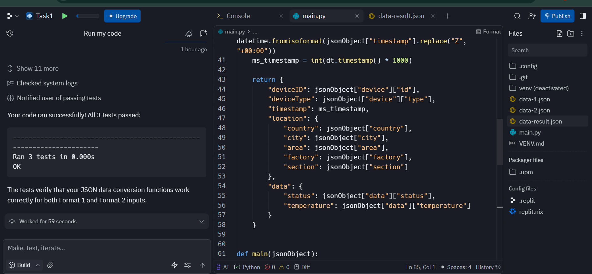

# JSON Telemetry Normalizer

This project converts **two different IoT telemetry JSON formats** into a **single unified format**.  
It includes complete unit tests to verify that the output is correct for both input formats.

---

## 🚀 Features

- Converts JSON Format 1 → Unified Format  
- Converts JSON Format 2 → Unified Format  
- Handles timestamp normalization  
- Combines fields into a clean, structured output  
- Fully tested using Python `unittest`

---

## 🗂 Project Structure

```
json-telemetry-normalizer/
│
├── main.py
├── data-1.json
├── data-2.json
├── data-result.json
└── README.md
```

---

## 🧪 Running the Tests

Make sure you have Python installed.

### 1️⃣ Open a terminal  
### 2️⃣ Navigate to the folder

```
cd json-telemetry-normalizer
```

### 3️⃣ Run the code

```
python main.py
```

If everything is correct, you will see:

```
OK
```

---

## 📥 Input Format Examples

### **Format 1 Input (data-1.json)**

```json
{
  "ts": "2023-06-30T12:24:13Z",
  "sensorType": "SmartWatch",
  "sensorData": {
    "heart": 92,
    "bp": "130/75"
  },
  "user": {
    "id": "AB-123",
    "age": 25
  }
}
```

---

### **Format 2 Input (data-2.json)**

```json
{
  "device": {
    "type": "SmartWatch"
  },
  "readings": {
    "heartRate": 92,
    "bloodPressure": "130/75"
  },
  "timestamp_ms": 1688127853000,
  "profile": {
    "userId": "AB-123",
    "age": 25
  }
}
```

---

## 🎯 Output Unified Format (data-result.json)

```json
{
  "timestamp": 1688127853000,
  "device_type": "SmartWatch",
  "metrics": {
    "heart_rate": 92,
    "blood_pressure": "130/75"
  },
  "user": {
    "id": "AB-123",
    "age": 25
  }
}
```

---

## 💡 What This Project Shows

- JSON data cleaning  
- Normalization between formats  
- Working with timestamps  
- Python dictionary manipulation  
- Writing unit tests  
- Consistent output formatting  

This is perfect for showcasing **Python skills**, **problem solving**, and **data processing knowledge**.

---

## 👩‍💻 Author

Nabeela Fatima  
B.Tech (2nd Year) — GNITS  
 


